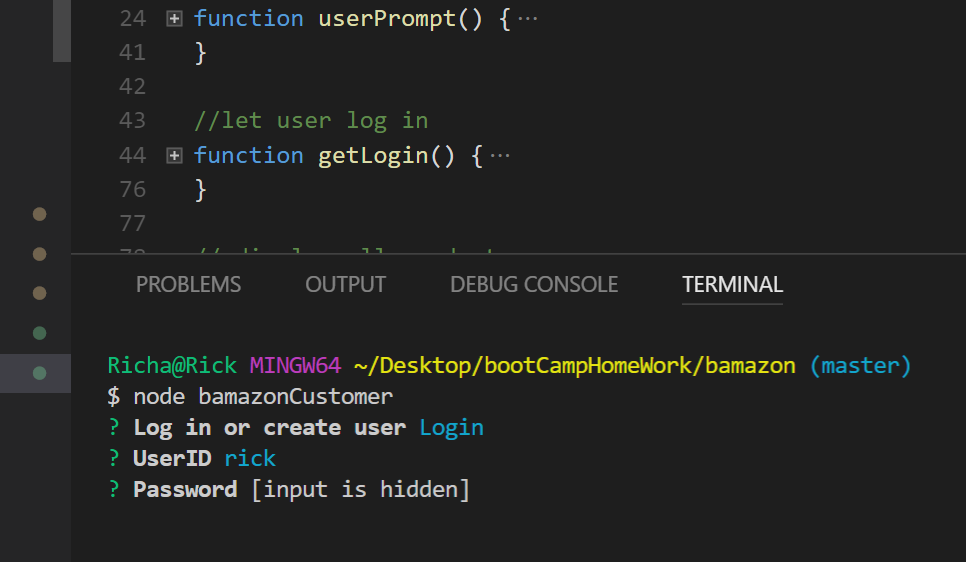

# bamazon
broke ass amazon

execute node code

select option to create a new user or login

if you select create user and the name already exists you will be prompted to select another user name

If you select user you then will be prompted to select an item to purchase

you will then be prompted to selec tthe number of items

if you select a number larger than the QTY allowed you will be prompted to select another item

